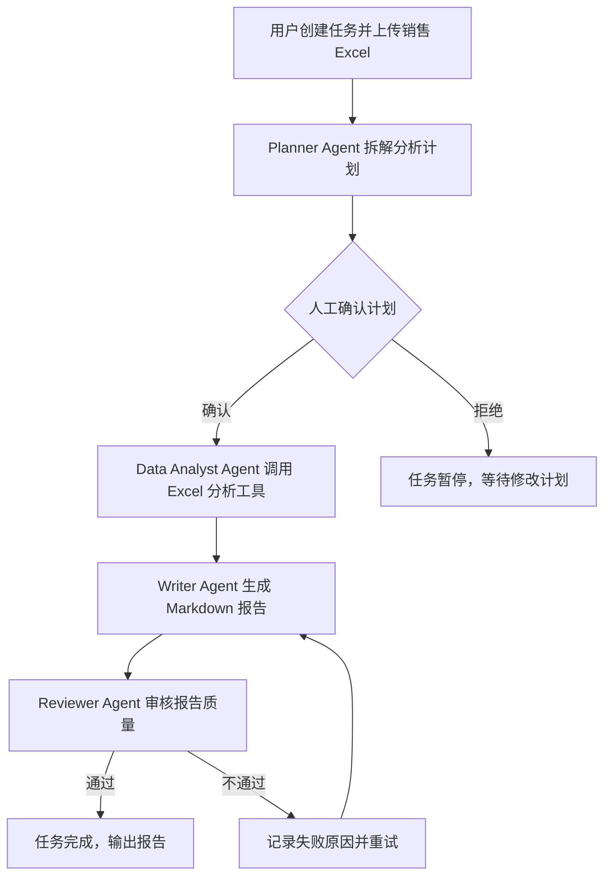
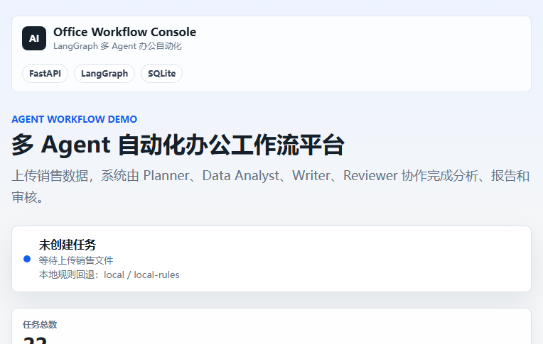
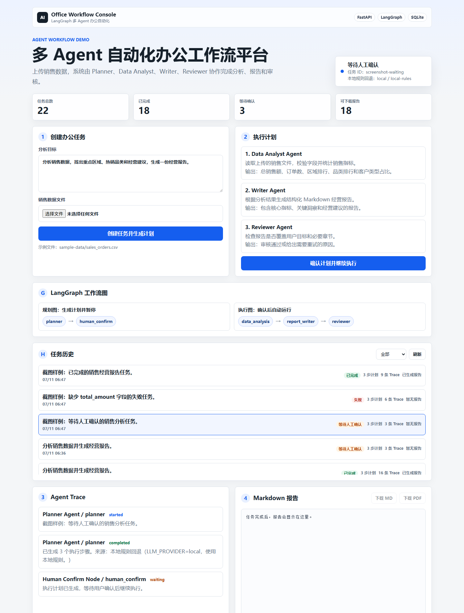
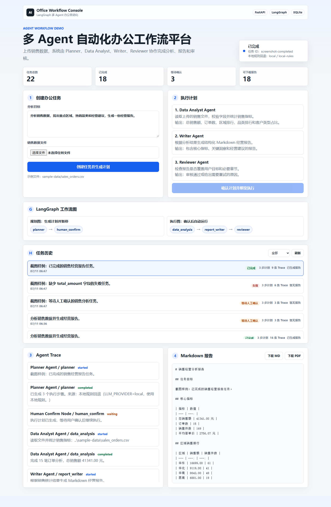
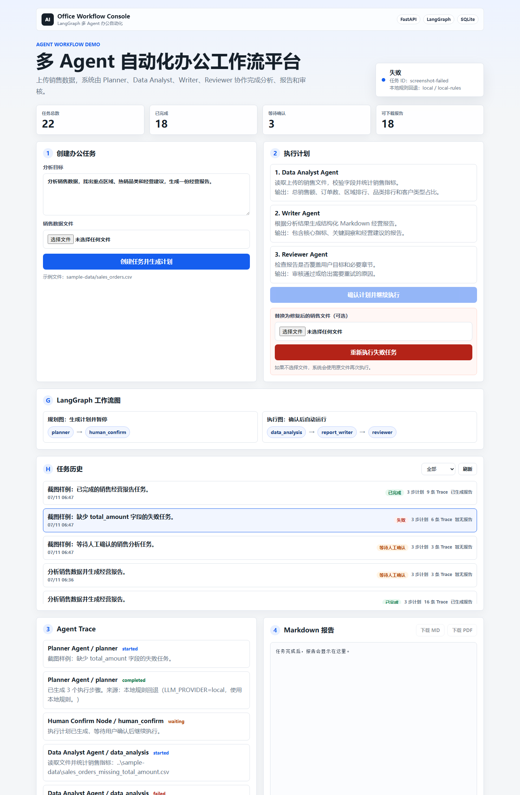

# 多 Agent 自动化办公工作流平台

面向企业办公场景的 AI Agent 技术展示项目。用户上传销售 Excel 并输入任务目标，例如“分析本月销售数据并生成经营报告”，系统会创建任务，由 Planner、Data Analyst、Writer、Reviewer 等角色协作完成分析、报告生成、质量审核和结果归档。

这个项目不是单个 AI 工具，而是一个可观察、可编排、可恢复的 Agent Workflow 系统。重点展示任务规划、工具调用、多 Agent 协作、执行链路 Trace、失败重试、人工确认节点，以及 Markdown/PDF 报告产出。

## 项目价值

很多企业办公自动化需求不是一次问答能完成的，而是需要多步骤协作：

```text
上传文件 -> 理解任务 -> 拆解计划 -> 人工确认 -> 数据分析 -> 报告写作 -> 质量审核 -> 导出结果
```

本项目把这条链路做成可运行、可复盘的技术展示系统，用来说明：

- Agent 如何拆解任务，而不是只生成一段文本。
- 工具如何参与执行，例如读取 Excel、统计销售数据、生成报告。
- 每个 Agent 节点的输入、输出、状态和耗时如何记录。
- 失败时如何重试或进入人工处理。
- 最终如何产出 Markdown/PDF 报告。

## 核心功能

- 任务创建：上传销售 Excel，填写分析目标。
- 任务拆解：Planner Agent 生成执行计划。
- 人工确认：关键计划需要用户确认后继续执行。
- 多 Agent 协作：Planner、Data Analyst、Writer、Reviewer 分工处理。
- 工具调用：Excel 读取、销售统计、Markdown 报告生成。
- Trace 可观测：记录每个节点的状态、输入摘要、输出摘要和错误信息。
- 失败重试：节点失败后记录 retry 次数，后续扩展自动重试策略。
- 报告输出：支持 Markdown 和 PDF 下载。
- 任务历史：支持历史任务列表、状态筛选和详情复盘。
- 登录权限：内置 demo 账号，任务按用户隔离。
- 图表分析：支持月度趋势、区域排行、品类排行、销售员排行和客户结构。
- 异步执行：支持 Celery/Redis 队列执行，默认保留本地 inline 回退。
- 失败恢复：支持错误数据触发失败 Trace，并可上传修复后的文件重试。
- 无 Key 稳定演示：使用本地规则跑通完整流程，也可以接入远程 LLM。

## 技术栈

| 模块 | 技术 |
| --- | --- |
| 后端 | Python + FastAPI + Pydantic |
| Agent 编排 | LangGraph StateGraph |
| 数据处理 | Python 标准库 CSV + openpyxl |
| 数据库 | SQLite |
| 登录权限 | JWT + SQLite 用户表 + PBKDF2 密码哈希 |
| 异步任务 | Celery + Redis，可关闭并回退 inline 执行 |
| LLM 接入 | DeepSeek / OpenAI 兼容 Chat Completions，本地规则回退 |
| 报告 | Markdown + PDF 导出 |
| 前端 | Next.js + React + TypeScript + Recharts |
| 测试 | pytest + FastAPI TestClient |

## 第一版业务流程



## 当前目录结构

```text
document-workflow-agent/
  backend/
    app/
      main.py
      api/
      core/
        models.py
      db/
        repository.py
    services/
        sales_analyzer.py
        workflow.py          # LangGraph StateGraph 编排
        report_renderer.py
    tests/
      test_workflow.py
    requirements.txt
    .env.example
  frontend/
    index.html
    styles.css
    app.js
  frontend-next/
    src/
      app/
      components/
      lib/
    package.json
  sample-data/
    sales_orders.csv
    sales_orders.xlsx
  docs/
    architecture.md
    day1_design.md
    demo_script.md
```

## 本地运行

进入后端目录：

```powershell
cd C:\Users\43448\Documents\入职准备\document-workflow-agent\backend
```

安装依赖：

```powershell
pip install -r requirements.txt
```

启动后端：

```powershell
python -m uvicorn app.main:app --reload --port 8020
```

健康检查：

```text
http://127.0.0.1:8020/health
```

API 文档：

```text
http://127.0.0.1:8020/docs
```

启动 Next.js 前端：

```powershell
cd C:\Users\43448\Documents\入职准备\document-workflow-agent\frontend-next
npm install --registry=https://registry.npmmirror.com
npm run dev
```

前端地址：

```text
http://127.0.0.1:3000
```

默认演示账号：

```text
demo@example.com / demo123456
```

旧版静态前端仍保留在 `frontend/`，后端也仍可访问 `/app`。

## Celery/Redis 可选异步执行

默认不需要 Redis，用户确认计划后会在 FastAPI 进程内 inline 执行，便于本地快速演示。

启用异步队列：

```env
ENABLE_CELERY=true
REDIS_URL=redis://localhost:6379/0
```

启动 worker：

```powershell
cd C:\Users\43448\Documents\入职准备\document-workflow-agent\backend
celery -A app.worker.celery_app worker --loglevel=info
```

启用 Celery 后，确认计划接口会把任务置为 `queued` 并投递给 worker，Next.js 前端会轮询任务详情和 Trace，直到任务完成或失败。

## LLM 配置

第一版默认使用本地规则，不配置 Key 也能完整演示：

```env
LLM_PROVIDER=local
LLM_API_KEY=
LLM_BASE_URL=
LLM_MODEL=
```

接入 DeepSeek：

```env
LLM_PROVIDER=deepseek
LLM_API_KEY=你的 DeepSeek API Key
LLM_BASE_URL=https://api.deepseek.com
LLM_MODEL=deepseek-chat
```

接入 OpenAI：

```env
LLM_PROVIDER=openai
LLM_API_KEY=你的 OpenAI API Key
LLM_BASE_URL=https://api.openai.com/v1
LLM_MODEL=gpt-4o-mini
```

接入其他 OpenAI 兼容服务：

```env
LLM_PROVIDER=openai-compatible
LLM_API_KEY=你的 API Key
LLM_BASE_URL=https://你的服务地址/v1
LLM_MODEL=模型名称
```

Planner Agent 和 Writer Agent 会优先调用远程 LLM。如果没有 Key、网络失败、响应格式错误，系统会自动回退到本地规则，保证技术演示和本地调试不中断。

查看当前模型状态：

```text
GET /api/llm/status
```

## 推荐演示流程

1. 启动后端和 Next.js 前端。
2. 使用 demo 账号登录。
3. 使用 `sample-data/sales_orders.xlsx` 或 `sample-data/sales_orders.csv` 作为上传文件。
4. 输入任务目标：`分析销售数据，找出重点区域、热销品类和经营建议，生成一份经营报告。`
5. 创建任务后查看 Planner 生成的执行计划。
6. 点击确认计划，让工作流继续执行。
7. 查看销售趋势、排行图表和 Agent Trace。
8. 查看最终 Markdown 报告。
9. 下载 Markdown 或 PDF 报告，展示系统可以交付办公成果文件。

## 登录和权限接口

```text
POST /api/auth/login
POST /api/auth/register
GET /api/auth/me
```

任务接口需要携带：

```text
Authorization: Bearer <access_token>
```

## 报告下载接口

```text
GET /api/tasks/{task_id}/report.md
GET /api/tasks/{task_id}/report.pdf
```

说明：

- `report.md` 返回 Markdown 文件，带 `Content-Disposition` 下载文件名。
- `report.pdf` 返回 PDF 文件，使用 ReportLab 将 Markdown 报告转换为可下载 PDF。
- 如果任务还没有生成报告，接口返回 `404 Report is not generated yet.`。

## 功能截图

截图清单见：

```text
docs/screenshots/README.md
```

建议优先准备控制台总览、Planner 人工确认、LangGraph Trace、报告下载和历史任务复盘截图。

当前已生成的代表性截图：

### 控制台总览



### Planner 人工确认



### LangGraph Trace 和报告预览



### 失败任务 Trace



## 任务历史和复盘

```text
GET /api/tasks
GET /api/tasks/{task_id}
GET /api/tasks/{task_id}/trace
```

说明：

- `GET /api/tasks` 返回任务摘要列表，包括状态、是否有报告、计划步骤数和 Trace 数量。
- 任务列表只返回当前登录用户自己的任务。
- 前端支持按状态筛选：全部、等待确认、已完成、失败。
- 点击历史任务后，会恢复该任务的执行计划、Agent Trace、Markdown 报告和下载按钮。

## 失败任务和重试

错误样例文件：

```text
sample-data/sales_orders_missing_total_amount.csv
```

该文件缺少 `total_amount` 字段，用于演示 Data Analyst Agent 的失败 Trace。

重试接口：

```text
POST /api/tasks/{task_id}/retry
```

说明：

- 只允许对 `failed` 状态任务重试。
- 可以不上传文件，系统会使用原文件重新执行。
- 可以上传修复后的 CSV/XLSX，系统会替换任务文件并重新生成计划。
- 旧 Trace 会保留，新 Trace 会追加，方便复盘失败和恢复过程。

## 项目说明

**多 Agent 自动化办公工作流平台 | FastAPI + LangGraph + SQLite**

- 设计并实现面向办公自动化场景的 Agent Workflow 系统，支持销售 Excel 上传、任务拆解、多 Agent 协作、工具调用、人工确认和报告生成。
- 使用 FastAPI 构建任务 API，使用 SQLite 保存任务状态、执行步骤和 Trace 日志，前端可展示完整执行链路。
- 将工作流拆分为 Planner、Data Analyst、Writer、Reviewer 等角色，模拟企业数字员工协作完成数据分析和经营报告生成。
- 设计登录权限、失败重试、人工确认、Celery/Redis 异步队列和无 Key 本地规则回退机制，保证项目在技术演示和本地调试中稳定运行。

## 当前进度

- 第 1 天：完成项目定位、文档、示例数据、FastAPI 后端、SQLite 存储、轻量前端和本地规则闭环。
- 第 2 天：接入 LangGraph `StateGraph`，将工作流拆成规划图和执行图，并新增 `/api/workflow/graph` 展示图结构。
- 第 3 天：接入 LLM Provider 适配层，Planner 和 Writer 支持远程模型 + 本地规则回退双模式。
- 第 4 天：增加 Markdown/PDF 报告下载接口，前端支持下载报告文件。
- 第 5 天：增加任务历史列表、状态筛选和任务详情复盘。
- 第 6 天：优化前端控制台视觉，增加任务指标卡，并补充功能截图清单。
- 第 7 天：增加失败任务样例、错误 Trace 和失败任务重试接口。
- 第 8 天：升级 Next.js 前端，增加 Excel 图表分析、demo 登录、任务权限和 Celery/Redis 可选异步执行。

## 后续计划

- 增加任务节点级别的失败重试配置。
- 补充新版 Next.js 截图和完整技术讲解稿。
