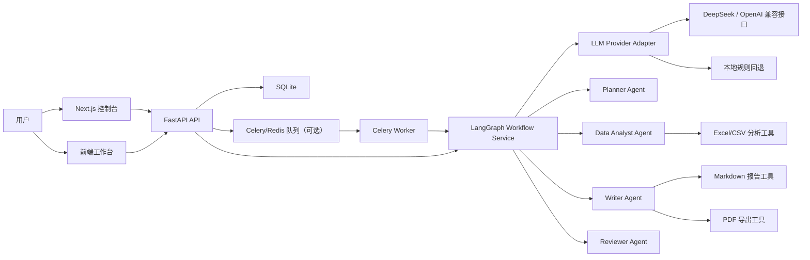
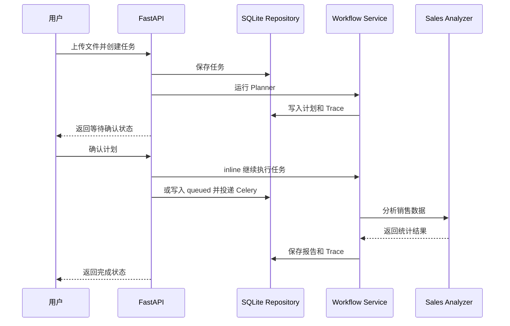

# 架构说明

## 系统分层



## 后端模块

| 模块 | 作用 |
| --- | --- |
| `main.py` | FastAPI 应用入口 |
| `core/models.py` | Pydantic 数据结构 |
| `db/repository.py` | SQLite 读写 |
| `services/workflow.py` | LangGraph `StateGraph` 工作流编排 |
| `services/sales_analyzer.py` | 销售数据分析工具 |
| `services/report_renderer.py` | Markdown 报告生成 |
| `services/pdf_renderer.py` | Markdown 转 PDF 导出 |
| `services/llm_provider.py` | DeepSeek / OpenAI 兼容模型适配 |
| `services/auth.py` | 密码哈希、JWT 签发和校验 |
| `services/task_runner.py` | Celery 队列投递和 inline 回退 |
| `worker.py` | Celery worker 入口 |
| `core/config.py` | LLM、认证、Worker 环境变量配置 |

## 数据流



## LangGraph 图设计

第 2 天开始，项目不再只是普通函数顺序调用，而是使用 LangGraph `StateGraph` 管理工作流节点。

### 规划图

```text
START -> planner -> human_confirm -> END
```

规划图只负责生成计划，并在人工确认节点暂停。这样可以避免系统直接执行一个用户还没确认的分析计划。

### 执行图

```text
START -> data_analysis -> report_writer -> reviewer -> END
```

执行图只在用户确认后运行。Reviewer 节点会判断报告是否合格，后续可以扩展为“不合格则回到 report_writer 重试”。

## 稳定性设计

- 无 API Key 时使用本地规则跑通流程。
- LLM 调用失败、返回空内容、返回格式不符合预期时自动回退本地规则。
- 每个节点都写入 Trace，便于定位失败位置。
- 节点记录 `retry_count`，后续可扩展自动重试。
- 人工确认节点将自动执行拆成两段，避免错误计划直接执行。
- 任务归属到用户，所有任务详情、Trace、重试和报告下载都校验 owner。
- Celery/Redis 关闭时使用 inline fallback，保证没有 Redis 也能跑完整流程。
- 数据分析工具先校验字段，字段缺失时给出明确错误。
- 报告生成后支持 Markdown 和 PDF 两种下载格式，便于真实办公交付。

## 登录和权限

系统内置 demo 账号：

```text
demo@example.com / demo123456
```

登录后后端签发 Bearer Token。任务创建时写入 `owner_id`，任务列表、任务详情、Trace、重试和报告下载都会校验当前用户，只能访问自己的任务。

## 异步执行

默认配置下 `ENABLE_CELERY=false`，确认计划后 FastAPI 直接 inline 执行 LangGraph workflow，方便本地演示。

当配置：

```env
ENABLE_CELERY=true
REDIS_URL=redis://localhost:6379/0
```

确认计划接口会把任务状态改为 `queued` 并投递到 Celery worker。worker 使用同一个 SQLite repository 和 `OfficeWorkflow` 执行任务，前端通过轮询任务详情获取状态和 Trace。

## 报告导出

报告生成后，后端提供两个下载接口：

```text
GET /api/tasks/{task_id}/report.md
GET /api/tasks/{task_id}/report.pdf
```

PDF 使用 ReportLab 在后端生成。当前版本会把 Markdown 中的标题、段落、列表和表格转换成 PDF，并使用中文 CID 字体保证中文内容可读。

## LLM 适配层

第 3 天新增 `LLMClient`，统一调用 OpenAI 兼容的 `/chat/completions` 接口。

支持模式：

| Provider | 说明 |
| --- | --- |
| `local` | 默认模式，不调用外部模型 |
| `deepseek` | 默认地址 `https://api.deepseek.com` |
| `openai` | 默认地址 `https://api.openai.com/v1` |
| `openai-compatible` | 自定义兼容服务地址 |

Planner 和 Writer 的策略一致：

```text
远程 LLM 可用 -> 调用模型 -> 校验输出 -> 使用模型结果
远程 LLM 不可用或结果不合格 -> 使用本地规则回退
```

这样既能展示真实模型接入能力，也能保证没有 Key 时项目仍然可运行。

## 技术展示视角

这个项目可以从三个层次说明：

1. 业务层：办公人员上传销售表，系统自动生成经营分析报告。
2. Agent 层：多个 Agent 按职责协作，而不是一个 Prompt 做到底。
3. 工程层：任务状态、Trace、失败重试、人工确认、报告产出构成完整闭环。
